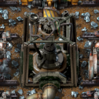

# Fracking Towers

Replaces mining productivity researches with fracking modules,
which are special productivity modules that only work on mining drills.
Fracking towers broadcast fracking modules in a wide area (like a beacon), at the cost of lubricant.

## Why?

I think infinite mining productivity tech is boring. Running research in the background is not one of the most interesting parts of Factorio, and I think that gaining a boost as powerful as mining productivity should come at an interesting cost.

Your mining outposts now need to send *and* recieve supplies: input lubricant and output ore.

I have not worked very much on the balancing of this mod, just the implementation (and the model, which took me ~3 weeks). If you think it is hideously unfair, then please open an issue with suggestions.

## Compatibility

So far, this mod only has explicit compatibility with Space Age. It moves the module techs to align wih Space Age's module progression; Fracking Module 1 requires red and green science, Fracking Module 2 requires space science, and Fracking Module 3 requires planetary techs and materials.

Also, all the modules and the tower can be made in the Foundry, for that sweet sweet productivity bonus. (And not the EM plant!)

If you would like to add your own compatibility via pull request I'd be happy to take it! But I'm not in the habit of playing planet overhaul mods, so I'm not likely to create compat for your mod out of whole cloth.

## Credits

- [Greeble Town Future Scratch Sci-fi Sketches](https://superhivemarket.com/products/free-future-scratch-sci-fi-sketches---scifi-kitbash-greeble-assets)
- I use [this Factorio blender preset file](https://www.youtube.com/watch?v=qJ5LFbQwfkE) by TheKingJo
